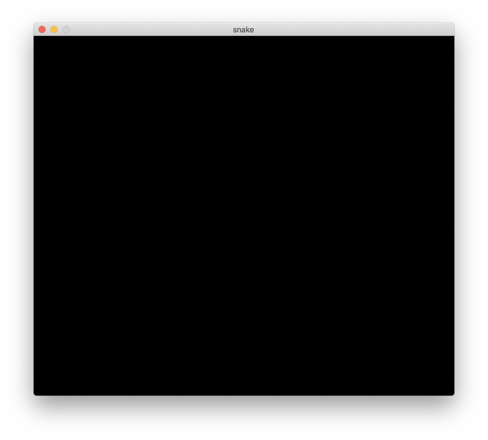

# Guides

Material for building the workshop tutorial.

## Concepts 

### Elxir Basics

We need to explain some Elixir basics like the data structures we use. We should have a look at the [Elixir Girls Elixir Beginners Guide](https://elixirgirls.com/guides/elixir-beginners-guide.html) for this. 

A first collection things we need to explain (very incomplete):

* iex
* data types
    * atoms
* data structures
    * tuple
    * list
    * map
* operators
    * pipe
* Enum module
* event loop
* ...

## Tutorial

We want to learn more about the [Elixir](https://elixir-lang.org) programming language by building a fun game together: **snake** - a cult game from mobile phones in the 1990s 🕹


The game works as follows:  
> The player controls a moving snake which has to "eat" as many items as possible by running into them with its head. Each item makes the snake grow longer and the game is lost when the head runs into the tail.

We will implement the game using [Scenic](https://github.com/boydm/scenic), a library for building native macOS or Linux applications with graphical user interfaces in Elixir.

So let's build a fun game together!

### 0. Getting ready

We first need to make sure we have Elixir installed on our computer. [Installing Elixir](https://elixir-lang.org/install.html) has installation instructions for all tastes and operating systems.

Once installed, check the version by running this command in your terminal:

    $ elixir --version

If your version is lower than `1.9.x`, either update to a more recent version or ask a coach for help.

Next, we'll install some `mix` tasks to help us build a `Scenic` application. [mix](https://hexdocs.pm/mix/Mix.html) is a tool that comes with Elixir to help developing apps and manage their dependencies. It is similar to e.g. `npm` in JavaScript (don't worry if you don't know that).

Specifically, we will use the `scenic_new` tasks which require some additional libraries installed on your computer. See the [install prerequisites](https://github.com/boydm/scenic_new#install-prerequisites) for installation instructions for your operating system.

Once everything is set up, you can install the tasks via `mix`:

    $ mix archive.install hex scenic_new

Now we are prepared to start building our Scenic application!

Navigate into your personal projects directory _(or wherever you want to keep the files for the tutorial)_ and then let's get started 🚀

### 1. Create a scenic app

First off we'll create a new Scenic application using our previously installed `scenic_new` mix task. We are building a snake game, so let's call our project `snake`. The `scenic_new` package gives us the handy `scenic.new` task which can be used to bootstrap a new Scenic application.

The task makes some assumptions about the typical structure of a Scenic application. It will generate a skeleton for our snake app with all directories and files already in place. This is "boilerplate" code we would otherwise need to write by hand.

Run this in you terminal:

    $ mix scenic.new snake

You will see output like this:

    * creating .formatter.exs
    * creating .gitignore
    * creating README.md
    * creating mix.exs
    * creating config
    * creating config/config.exs
    * creating lib
    * creating lib/components
    * creating lib/snake.ex
    * creating lib/scenes
    * creating lib/scenes/home.ex
    * creating priv/static
    Your Scenic project was created successfully.
    Next steps for getting started:
        $ cd snake
        $ mix deps.get
    You can start your app with:
        $ mix scenic.run
    You can also run it interactively like this:
        $ iex -S mix

We see it generated some files inside a new `snake` folder and gives us hints about what we can do next.

First, we need to navigate into our new project directory:

    $ cd snake

Let's see what we got:

    $ ls

We will have a look at the `mix.exs` file - open the file in your editor.

This file contains some core information about our project. There is a `deps` section at the bottom of the file listing the dependencies needed for running the project. The dependencies are other Elixir libraries, hosted as "hex" packages on [hex.pm](https://hex.pm)

> Coach: talks about hex and package managers

    defp deps do
      [
        {:scenic, "~> 0.10"},
        {:scenic_driver_glfw, "~> 0.10", targets: :host}
      ]
    end

To run the app, we need install the listed libraries.
`mix` also gives us a task to do that, let's run it in the terminal:

    $ mix deps.get

Now we are ready to run new Scenic project and check that everything is working 🤞. The `scenic_new` package also gives us a command to run our project:

    $ mix scenic.run

We should see a window similar to this:


### 2. Draw a worm

In our retro game, all objects and their movements are organized in big square "pixels". The pallet is a single pixel and the snake a line of these pixels moving one pixel a step. We'll therefore describe our playing field as a grid of square cells addressable like a coordinate system:
- x-axis: 21 cells (tile 0 to 20)
- y-axis: 18 cells (tile 0 to 17)

```
   │ 0│ 1│ 2│ 3│ 4│ 5│ 6│ 7│ 8│ 9│10│11│12│13│14│15│16│17│18│19│20│
───┼──┼──┼──┼──┼──┼──┼──┼──┼──┼──┼──┼──┼──┼──┼──┼──┼──┼──┼──┼──┼──┼───
  0│  │  │  │  │  │  │  │  │  │  │  │  │  │  │  │  │  │  │  │  │  │ 0
───┼──┼──┼──┼──┼──┼──┼──┼──┼──┼──┼──┼──┼──┼──┼──┼──┼──┼──┼──┼──┼──┼───
  1│  │  │  │  │  │  │  │  │  │  │  │  │  │  │  │  │  │  │  │  │  │ 1
───┼──┼──┼──┼──┼──┼──┼──┼──┼──┼──┼──┼──┼──┼──┼──┼──┼──┼──┼──┼──┼──┼───
  2│  │  │  │  │  │  │  │  │  │  │  │  │  │  │  │  │  │  │  │  │  │ 2
───┼──┼──┼──┼──┼──┼──┼──┼──┼──┼──┼──┼──┼──┼──┼──┼──┼──┼──┼──┼──┼──┼───
  3│  │  │  │  │  │  │  │  │  │  │  │  │  │  │  │  │  │  │  │  │  │ 3
───┼──┼──┼──┼──┼──┼──┼──┼──┼──┼──┼──┼──┼──┼──┼──┼──┼──┼──┼──┼──┼──┼───
  4│  │  │  │  │  │  │  │  │  │  │  │  │  │  │  │  │  │  │  │  │  │ 4
───┼──┼──┼──┼──┼──┼──┼──┼──┼──┼──┼──┼──┼──┼──┼──┼──┼──┼──┼──┼──┼──┼───
  5│  │  │  │  │  │  │  │  │  │  │  │  │  │  │  │  │  │  │  │  │  │ 5
───┼──┼──┼──┼──┼──┼──┼──┼──┼──┼──┼──┼──┼──┼──┼──┼──┼──┼──┼──┼──┼──┼───
  6│  │  │  │  │  │  │  │  │  │  │  │  │  │  │  │  │  │  │  │  │  │ 6
───┼──┼──┼──┼──┼──┼──┼──┼──┼──┼──┼──┼──┼──┼──┼──┼──┼──┼──┼──┼──┼──┼───
  7│  │  │  │  │  │  │  │  │  │  │  │  │  │  │  │  │  │  │  │  │  │ 7
───┼──┼──┼──┼──┼──┼──┼──┼──┼──┼──┼──┼──┼──┼──┼──┼──┼──┼──┼──┼──┼──┼───
  8│  │  │  │  │  │  │  │  │  │  │  │  │  │  │  │  │  │  │  │  │  │ 8
───┼──┼──┼──┼──┼──┼──┼──┼──┼──┼──┼──┼──┼──┼──┼──┼──┼──┼──┼──┼──┼──┼───
  9│  │  │  │  │  │  │  │  │  │  │  │  │  │  │  │  │  │  │  │  │  │ 9
───┼──┼──┼──┼──┼──┼──┼──┼──┼──┼──┼──┼──┼──┼──┼──┼──┼──┼──┼──┼──┼──┼───
 10│  │  │  │  │  │  │  │  │  │  │  │  │  │  │  │  │  │  │  │  │  │10
───┼──┼──┼──┼──┼──┼──┼──┼──┼──┼──┼──┼──┼──┼──┼──┼──┼──┼──┼──┼──┼──┼───
 11│  │  │  │  │  │  │  │  │  │  │  │  │  │  │  │  │  │  │  │  │  │11
───┼──┼──┼──┼──┼──┼──┼──┼──┼──┼──┼──┼──┼──┼──┼──┼──┼──┼──┼──┼──┼──┼───
 12│  │  │  │  │  │  │  │  │  │  │  │  │  │  │  │  │  │  │  │  │  │12
───┼──┼──┼──┼──┼──┼──┼──┼──┼──┼──┼──┼──┼──┼──┼──┼──┼──┼──┼──┼──┼──┼───
 13│  │  │  │  │  │  │  │  │  │  │  │  │  │  │  │  │  │  │  │  │  │13
───┼──┼──┼──┼──┼──┼──┼──┼──┼──┼──┼──┼──┼──┼──┼──┼──┼──┼──┼──┼──┼──┼───
 14│  │  │  │  │  │  │  │  │  │  │  │  │  │  │  │  │  │  │  │  │  │14
───┼──┼──┼──┼──┼──┼──┼──┼──┼──┼──┼──┼──┼──┼──┼──┼──┼──┼──┼──┼──┼──┼───
 15│  │  │  │  │  │  │  │  │  │  │  │  │  │  │  │  │  │  │  │  │  │15
───┼──┼──┼──┼──┼──┼──┼──┼──┼──┼──┼──┼──┼──┼──┼──┼──┼──┼──┼──┼──┼──┼───
 16│  │  │  │  │  │  │  │  │  │  │  │  │  │  │  │  │  │  │  │  │  │16
───┼──┼──┼──┼──┼──┼──┼──┼──┼──┼──┼──┼──┼──┼──┼──┼──┼──┼──┼──┼──┼──┼───
 17│  │  │  │  │  │  │  │  │  │  │  │  │  │  │  │  │  │  │  │  │  │17
───┼──┼──┼──┼──┼──┼──┼──┼──┼──┼──┼──┼──┼──┼──┼──┼──┼──┼──┼──┼──┼──┼───
   │ 0│ 1│ 2│ 3│ 4│ 5│ 6│ 7│ 8│ 9│10│11│12│13│14│15│16│17│18│19│20│
```

The main action in our game happens within one fixed view containing this grid. Scenic refers to this as one ["scene"](https://hexdocs.pm/scenic/overview_general.html#scene) of the application.

A scene is implemented as a [GenServer](https://elixir-lang.org/getting-started/mix-otp/genserver.html) process under the hood. It contains the state and all business logic to handle input by the user. Navigating between screens of the application means moving from scene to scene.

> Coach: Briefly talk about processes in Elixir and GenServers as the standard "interface" for processes which allow to keep state etc.

So let's start building the main scene for our game!

Create a new file named `game.ex` in the `lib/scenes` directory of the project and open it. In there, we'll define a module called "Game".

```elixir
defmodule Snake.Scene.Game do
  use Scenic.Scene
end
```

We turn our module into a Scenic "scene" by using the `Scenic.Scene` macro. This will automatically inject some functions into the module and require us to implement a certain "behavior". In our case, this means we'll have to implement an `init/2` callback. This function is called when the scene is started and meant to be used to set up the state of the scene. It takes two arguments, the first is passed in by the process which starts the scene and the second is an optional list of contextual options, such as information about the viewport:

```elixir
def init(arg, opts) do

end
```

With that set up, let's restart our game:

    $ mix scenic.run

Nothing changed! We need to update the configuration of our project to take this scene as the entry point for our application. So let's change the `default_scene` in the `config/config.exs` file to be our new `Game` module:

```elixir
default_scene: {Snake.Scene.Game, nil},
```

Run the application again and see there: a black screen!



That's a starting point!

Let's continue with the basis of our game: the pixel grid. In order to know how many squares we can fit into the scene, we need some information about the size of the application window, the so called _"viewport"_. We can retrieve that from the contextual information generated by Scenic and passed into our `init/2` function as the second `opt` parameter. We'll make use of the `info` function from Scenic's `ViewPort` module and print out what we get there:

```elixir
defmodule Snake.Scene.Game do
  use Scenic.Scene

  alias Scenic.ViewPort

  def init(arg, opts) do
    viewport = opts[:viewport]

    IO.inspect(ViewPort.info(viewport), label: "viewport info")
  end
end
```

Running the game again, we see we have some information about the size of the view port in pixels. We can use this information to compute the number of rows and cells in our grid.

When running the game you may have noticed the compiler warning us:

    warning: variable "arg" is unused (if the variable is not meant to be used, prefix it with an underscore)

In our configuration, we are passing `nil` as the first `arg` parameter to the `init/2` function of our `Game` scene, which already indicates that we're not planning to provide any information meant for further usage here. So let's follow the compiler's suggestions and prefix the argument with an underscore to indicate that we know about the parameter but don't need it:

```elixir
def init(_arg, opts) do
  viewport = opts[:viewport]

  IO.inspect(ViewPort.info(viewport), label: "viewport info")
end
```

So let's use the view port information to set up our grid. We'll define the default length of 32 pixels for the edge of one square and then compute how many we can fit onto the screen. As this information is necessary throughout the whole game, we store it in the `state` of the scene.

```elixir
@tile_size 32

def init(_arg, opts) do
  viewport = opts[:viewport]

  {:ok, %ViewPort.Status{size: {vp_width, vp_height}}} = ViewPort.info(viewport)

  num_tiles_width = trunc(vp_width / @tile_size)
  num_tiles_height = trunc(vp_height / @tile_size)

  state = %{
    width: num_tiles_width,
    height: num_tiles_height
  }
end
```

Next we'll introduce the "graph" for our scene. The concept of a "graph" in Scenic is similar to the "DOM" in HTML: it a hierarchical description of the objects drawn onto the scene. Graphs are immutable and can only be transformed via functions. We'll set up the initial graph at compile time.

> Coach: Talk about immutability in functional programming / Elixir.

```elixir
alias Scenic.ViewPort
alias Scenic.Graph

@graph Graph.build()
@tile_size 32
```

Running the app, you won't see any change yet. We have to push our graph to the view port when we initialize the scene. We will also return the initial state we just set up:

```elixir
def init(_arg, opts) do
  viewport = opts[:viewport]

  {:ok, %ViewPort.Status{size: {vp_width, vp_height}}} = ViewPort.info(viewport)

  num_tiles_width = trunc(vp_width / @tile_size)
  num_tiles_height = trunc(vp_height / @tile_size)

  state = %{
    width: num_tiles_width,
    height: num_tiles_height
  }

  {:ok, state, push: @graph}
end
```

Let's run the game!

Nothing changed? That's because our graph does not contain any objects yet and we did not give it any attributes differing from Scenic's defaults.

Let's start by changing the default background of the scene from black to a more Nokia style color:

```elixir
@graph Graph.build(clear_color: :dark_sea_green)
```

Nice! We already get that 90s feeling.

The first object we want to draw on our scene is the snake. We'll define it as an ordered list of x and y coordinate pairs corresponding to the locations of the cells in the grid the snake is currently occupying. We'll refer to this as the "body" of the snake. In addition to that, we'll also add information about the current "size" of the snake. That should be enough to be able to draw the snake onto the scene:

```elixir
snake = %{body: [{9, 9}], size: 1}
```

In order to actually draw it onto the scene, we need to add it to the graph of our scene. So let's update our initial graph and add our snake object to it.

```elixir
state = %{
  width: num_tiles_width,
  height: num_tiles_height
}

snake = %{body: [{9, 9}], size: 1}

graph =
  @graph
  |> draw_object(snake)

{:ok, state, push: graph}
```

To keep things organized, we'll implement our own `draw_object/2` helper function which will turn our abstract snake object into actual drawable objects for Scenic. The function takes two arguments: the graph and our snake object.

> Coach: Talk about pipelines.

For each square of the snake's body, we draw a tile one our grid.

```elixir
defp draw_object(graph, %{body: snake}) do
  Enum.reduce(snake, graph, fn {x, y}, graph ->
    draw_tile(graph, x, y, fill: :drak_slate_gray)
  end)
end
```

Then we'll add a separate function draw a single tile. We can use the `rrect/3` function from Scenic's `Primitives` module for that. To keep the snake's body distinguishable as individual tiles, we'll draw the rectangle with rounded corners. Black will be the default fill color, but whatever is passed in via the `opts` argument will override that.

```elixir
import Scenic.Primitives, only: [rrect: 3]

@tile_radius 8

defp draw_tile(graph, x, y, opts) do
  tile_opts = Keyword.merge([fill: :black, translate: {x * @tile_size, y * @tile_size}], opts)
  graph |> rrect({@tile_size, @tile_size, @tile_radius}, tile_opts)
end
```

Now we have the first objects in our graph. Let's see how this looks like!

Our snake does not look too snaky yet if it's that short. Let's change that and make it occupy three tiles:

```elixir
snake = %{body: [{9, 9}, {10, 9}, {11, 9}], size: 3}
```


### 3. Let the worm move

- TODO:
  - explain game mechanics
  - explain why we need to update with `handle_info/2`
  - refactor game to be generic about drawing objects

### 4. Add food for the worm

### 5. Control worm movement

### 6. Allow worm to eat

### 7. Allow worm to die

### 8. Add static score

### 9. Add live scoring

### 10. Potential later steps

- move things into components (e.g. the score, the snake)
- add multiplayer

### Create a Scenic App

Creating a new scenic application from scratch.

Run the mix task to create a new Scenic project:

    $ mix scenic.new snake

Move into the newly created directory:

    $ cd snake

Install the depedencies:

    $ mix deps.get

Run the app to check everything is working:

    $ mix scenic.run
