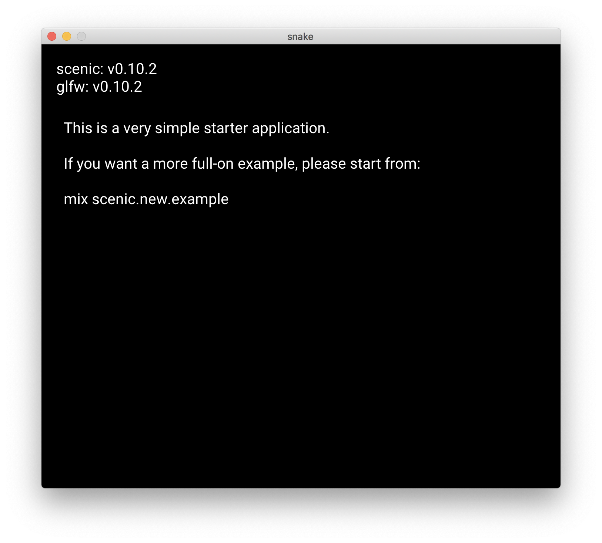

# Guides

Material for building the workshop tutorial.

## Concepts 

### Elxir Basics

We need to explain some Elixir basics like the data structures we use. We should have a look at the [Elixir Girls Elixir Beginners Guide](https://elixirgirls.com/guides/elixir-beginners-guide.html) for this. 

A first collection things we need to explain (very incomplete):

* iex
* data types
    * atoms
* data structures
    * tuple
    * list
    * map
* operators
    * pipe
* Enum module
* event loop
* ...

## Tutorial

We want to learn more about the [Elixir](https://elixir-lang.org) programming language by building a fun game together: **snake** - a cult game from mobile phones in the 1990s 🕹


The game works as follows:  
> The player controls a moving snake which has to "eat" as many items as possible by running into them with its head. Each item makes the snake grow longer and the game is lost when the head runs into the tail.

We will implement the game using [Scenic](https://github.com/boydm/scenic), a library for building native macOS or Linux applications with graphical user interfaces in Elixir.

So let's build a fun game together!

### 0. Getting ready

We first need to make sure we have Elixir installed on our computer. [Installing Elixir](https://elixir-lang.org/install.html) has installation instructions for all tastes and operating systems.

Once installed, check the version by running this command in your terminal:

    $ elixir --version

If your version is lower than `1.9.x`, either update to a more recent version or ask a coach for help.

Next, we'll install some `mix` tasks to help us build a `Scenic` application. [mix](https://hexdocs.pm/mix/Mix.html) is a tool that comes with Elixir to help developing apps and manage their dependencies. It is similar to e.g. `npm` in JavaScript (don't worry if you don't know that).

Specifically, we will use the `scenic_new` tasks which require some additional libraries installed on your computer. See the [install prerequisites](https://github.com/boydm/scenic_new#install-prerequisites) for installation instructions for your operating system.

Once everything is set up, you can install the tasks via `mix`:

    $ mix archive.install hex scenic_new

Now we are prepared to start building our Scenic application!

Navigate into your personal projects directory _(or wherever you want to keep the files for the tutorial)_ and then let's get started 🚀

### 1. Create a scenic app

First off we'll create a new Scenic application using our previously installed `scenic_new` mix task. We are building a snake game, so let's call our project `snake`. The `scenic_new` package gives us the handy `scenic.new` task which can be used to bootstrap a new Scenic application.

The task makes some assumptions about the typical structure of a Scenic application. It will generate a skeleton for our snake app with all directories and files already in place. This is "boilerplate" code we would otherwise need to write by hand.

Run this in you terminal:

    $ mix scenic.new snake

You will see output like this:

    * creating .formatter.exs
    * creating .gitignore
    * creating README.md
    * creating mix.exs
    * creating config
    * creating config/config.exs
    * creating lib
    * creating lib/components
    * creating lib/snake.ex
    * creating lib/scenes
    * creating lib/scenes/home.ex
    * creating priv/static
    Your Scenic project was created successfully.
    Next steps for getting started:
        $ cd snake
        $ mix deps.get
    You can start your app with:
        $ mix scenic.run
    You can also run it interactively like this:
        $ iex -S mix

We see it generated some files inside a new `snake` folder and gives us hints about what we can do next.

First, we need to navigate into our new project directory:

    $ cd snake

Let's see what we got:

    $ ls

We will have a look at the `mix.exs` file - open the file in your editor.

This file contains some core information about our project. There is a `deps` section at the bottom of the file listing the dependencies needed for running the project. The dependencies are other Elixir libraries, hosted as "hex" packages on [hex.pm](https://hex.pm)

> Coach: talks about hex and package managers

    defp deps do
      [
        {:scenic, "~> 0.10"},
        {:scenic_driver_glfw, "~> 0.10", targets: :host}
      ]
    end

To run the app, we need install the listed libraries.
`mix` also gives us a task to do that, let's run it in the terminal:

    $ mix deps.get

Now we are ready to run new Scenic project and check that everything is working 🤞. The `scenic_new` package also gives us a command to run our project:

    $ mix scenic.run

We should see a window similar to this:




### 2. Draw a worm

As we are building a retro game, our playing field is a grid of cells, addressable like a coordinate system:

* x-Axis: 21 Tiles (tile 0 to 20)
* y-Axis: 18 Tiles (tile 0 to 17)

```
   │ 0│ 1│ 2│ 3│ 4│ 5│ 6│ 7│ 8│ 9│10│11│12│13│14│15│16│17│18│19│20│
───┼──┼──┼──┼──┼──┼──┼──┼──┼──┼──┼──┼──┼──┼──┼──┼──┼──┼──┼──┼──┼──┼───
  0│  │  │  │  │  │  │  │  │  │  │  │  │  │  │  │  │  │  │  │  │  │ 0
───┼──┼──┼──┼──┼──┼──┼──┼──┼──┼──┼──┼──┼──┼──┼──┼──┼──┼──┼──┼──┼──┼───
  1│  │  │  │  │  │  │  │  │  │  │  │  │  │  │  │  │  │  │  │  │  │ 1
───┼──┼──┼──┼──┼──┼──┼──┼──┼──┼──┼──┼──┼──┼──┼──┼──┼──┼──┼──┼──┼──┼───
  2│  │  │  │  │  │  │  │  │  │  │  │  │  │  │  │  │  │  │  │  │  │ 2
───┼──┼──┼──┼──┼──┼──┼──┼──┼──┼──┼──┼──┼──┼──┼──┼──┼──┼──┼──┼──┼──┼───
  3│  │  │  │  │  │  │  │  │  │  │  │  │  │  │  │  │  │  │  │  │  │ 3
───┼──┼──┼──┼──┼──┼──┼──┼──┼──┼──┼──┼──┼──┼──┼──┼──┼──┼──┼──┼──┼──┼───
  4│  │  │  │  │  │  │  │  │  │  │  │  │  │  │  │  │  │  │  │  │  │ 4
───┼──┼──┼──┼──┼──┼──┼──┼──┼──┼──┼──┼──┼──┼──┼──┼──┼──┼──┼──┼──┼──┼───
  5│  │  │  │  │  │  │  │  │  │  │  │  │  │  │  │  │  │  │  │  │  │ 5
───┼──┼──┼──┼──┼──┼──┼──┼──┼──┼──┼──┼──┼──┼──┼──┼──┼──┼──┼──┼──┼──┼───
  6│  │  │  │  │  │  │  │  │  │  │  │  │  │  │  │  │  │  │  │  │  │ 6
───┼──┼──┼──┼──┼──┼──┼──┼──┼──┼──┼──┼──┼──┼──┼──┼──┼──┼──┼──┼──┼──┼───
  7│  │  │  │  │  │  │  │  │  │  │  │  │  │  │  │  │  │  │  │  │  │ 7
───┼──┼──┼──┼──┼──┼──┼──┼──┼──┼──┼──┼──┼──┼──┼──┼──┼──┼──┼──┼──┼──┼───
  8│  │  │  │  │  │  │  │  │  │  │  │  │  │  │  │  │  │  │  │  │  │ 8
───┼──┼──┼──┼──┼──┼──┼──┼──┼──┼──┼──┼──┼──┼──┼──┼──┼──┼──┼──┼──┼──┼───
  9│  │  │  │  │  │  │  │  │  │  │  │  │  │  │  │  │  │  │  │  │  │ 9
───┼──┼──┼──┼──┼──┼──┼──┼──┼──┼──┼──┼──┼──┼──┼──┼──┼──┼──┼──┼──┼──┼───
 10│  │  │  │  │  │  │  │  │  │  │  │  │  │  │  │  │  │  │  │  │  │10
───┼──┼──┼──┼──┼──┼──┼──┼──┼──┼──┼──┼──┼──┼──┼──┼──┼──┼──┼──┼──┼──┼───
 11│  │  │  │  │  │  │  │  │  │  │  │  │  │  │  │  │  │  │  │  │  │11
───┼──┼──┼──┼──┼──┼──┼──┼──┼──┼──┼──┼──┼──┼──┼──┼──┼──┼──┼──┼──┼──┼───
 12│  │  │  │  │  │  │  │  │  │  │  │  │  │  │  │  │  │  │  │  │  │12
───┼──┼──┼──┼──┼──┼──┼──┼──┼──┼──┼──┼──┼──┼──┼──┼──┼──┼──┼──┼──┼──┼───
 13│  │  │  │  │  │  │  │  │  │  │  │  │  │  │  │  │  │  │  │  │  │13
───┼──┼──┼──┼──┼──┼──┼──┼──┼──┼──┼──┼──┼──┼──┼──┼──┼──┼──┼──┼──┼──┼───
 14│  │  │  │  │  │  │  │  │  │  │  │  │  │  │  │  │  │  │  │  │  │14
───┼──┼──┼──┼──┼──┼──┼──┼──┼──┼──┼──┼──┼──┼──┼──┼──┼──┼──┼──┼──┼──┼───
 15│  │  │  │  │  │  │  │  │  │  │  │  │  │  │  │  │  │  │  │  │  │15
───┼──┼──┼──┼──┼──┼──┼──┼──┼──┼──┼──┼──┼──┼──┼──┼──┼──┼──┼──┼──┼──┼───
 16│  │  │  │  │  │  │  │  │  │  │  │  │  │  │  │  │  │  │  │  │  │16
───┼──┼──┼──┼──┼──┼──┼──┼──┼──┼──┼──┼──┼──┼──┼──┼──┼──┼──┼──┼──┼──┼───
 17│  │  │  │  │  │  │  │  │  │  │  │  │  │  │  │  │  │  │  │  │  │17
───┼──┼──┼──┼──┼──┼──┼──┼──┼──┼──┼──┼──┼──┼──┼──┼──┼──┼──┼──┼──┼──┼───
   │ 0│ 1│ 2│ 3│ 4│ 5│ 6│ 7│ 8│ 9│10│11│12│13│14│15│16│17│18│19│20│
```

- the whole game operates in a predefined grid:
  - snake and food for the snake will be drawn as filled boxes in the grid
  - movement only along the predefined grid
- in Scenic terms, our game will be a "scene"
  - see https://hexdocs.pm/scenic/overview_general.html#architecture
  - terms and definitions for Scenic: https://hexdocs.pm/scenic/overview_general.html#terms-and-definitions
  - scenes are like web pages:
    - every scene is a `GenServer` process containing state and the business logic to handle user input
    - navigating to different screens means navigate to different "scenes"
  - for our game, one scene is enough for the start as we won't navigate anywhere else
- start by building a new "scene" in `lib/scenes/game.ex`

    ```elixir
    defmodule Snake.Scene.Game do
      use Scenic.Scene
    end
    ```
- every scene must implement `init/2` callback
  - takes two arguments: first passed in by whoever starts the scene, second contextual options (e.g. viewport)

  ```elixir
  # initialize the game scene
  def init(arg, opts) do

  end
  ```
- run the game: nothing changed!
- we need to update the config: in `snake/config/config.exs`
  - change default scene to our game scene

    ```elixir
    default_scene: {Snake.Scene.Game, nil},
    ```
- outcome: completely empty scene
  - TODO: add sceenshot

- `nil` as the 2nd element in the tuple is what our `init/2` function receives as `arg`
  - since we're not using it, we could prefix it now...
- put together information for the game in the "state"
- scene is a `GenServer`: will maintain `state` during its lifetime
  - state needs to hold everything the scene needs to work
- set up viewport for scene
- we can get information about the view port to then assemble our grid accordingly

  ```elixir
  defmodule Snake.Scene.Game do
    use Scenic.Scene

    alias Scenic.ViewPort

    # initialize the game scene
    def init(arg, opts) do
      viewport = opts[:viewport]

      IO.inspect(ViewPort.info(viewport), label: "viewport info")
    end
  end
  ```

- dumps some info about the scene
  - we can find out about the size in pixels of our window and from that calculate how many cells we can fit
- set up grid system:

  ```elixir
  @tile_size 32

  def init(arg, opts) do
    viewport = opts[:viewport]

    {:ok, %ViewPort.Status{size: {vp_width, vp_height}}} = ViewPort.info(viewport)

    # dimensions of the grid (21x18 tiles, 0-indexed)
    num_tiles_width = trunc(vp_width / @tile_size)
    num_tiles_height = trunc(vp_height / @tile_size)

    # the entire game state will be held here
    state = %{
      viewport: viewport,
      width: num_tiles_width,
      height: num_tiles_height
    }
  end
  ```

- important concept in Scenic: "graph"
  - graph like DOM: hierarchical set of data that describes how things are drawn onto the scene
  - graph is immutable and can only be "transformed" via functions
- set up initial graph at compile time since we're updating all the time anyways:

  ```elixir
  alias Scenic.ViewPort
  alias Scenic.Graph

  @graph Graph.build()
  @tile_size 32

  # initialize the game scene
  def init(arg, opts) do
    viewport = opts[:viewport]

    {:ok, %ViewPort.Status{size: {vp_width, vp_height}}} = ViewPort.info(viewport)

    # dimensions of the grid (21x18 tiles, 0-indexed)
    num_tiles_width = trunc(vp_width / @tile_size)
    num_tiles_height = trunc(vp_height / @tile_size)

    # the entire game state will be held here
    state = %{
      viewport: viewport,
      width: num_tiles_width,
      height: num_tiles_height
    }
  end
  ```

- return `{:ok, state}` from `init/2`:
  
  ```elixir
  def init(arg, opts) do
    viewport = opts[:viewport]

    {:ok, %ViewPort.Status{size: {vp_width, vp_height}}} = ViewPort.info(viewport)

    # dimensions of the grid (21x18 tiles, 0-indexed)
    num_tiles_width = trunc(vp_width / @tile_size)
    num_tiles_height = trunc(vp_height / @tile_size)

    # the entire game state will be held here
    state = %{
      viewport: viewport,
      width: num_tiles_width,
      height: num_tiles_height
    }

    {:ok, state}
  end
  ```
- optionally give it a more Nokia style feel:
  - default background for the scene is black, but we can set the background like so:

    ```elixir
    @graph Graph.build(clear_color: :dark_sea_green)
    ```

- we need to add our graph to the scene to actually draw something
- add information about game objects: how can we define a snake?
  - we describe a snake via:
  - body: a list of ordered x and y pairs. Each pair corresponds to a cell in the grid the snake is currently occupying
  - size: the current size of the snake in cells

  ```elixir
  snake = %{body: [{9, 9}], size: 1}
  ```

- need to update the graph to actually draw something.

  ```elixir
  # the entire game state will be held here
  state = %{
    viewport: viewport,
    width: num_tiles_width,
    height: num_tiles_height
  }

  snake = %{body: [{9, 9}], size: 5}

  # update the graph and push it to be rendered
  graph =
    @graph
    |> draw_object(snake)

  {:ok, state, push: graph}
  ```
- need to implement the function to draw our game object onto the scene:
  - means: we add information to the graph on where to place what
  - new function: `draw_game_object/2` takes graph and our snake objects (we will have more objects later)
  - TODO: explain pipelines

  ```elixir
  defp draw_object(graph, %{body: snake}) do
    Enum.reduce(snake, graph, fn {x, y}, graph ->
      draw_tile(graph, x, y, fill: :blue)
    end)
  end
  ```

- match on the object we pass in (the snake)
- TODO: explain matching on maps
- snake essentially only a collection of tiles
- add private function to fill a tile in our coordinate system:
  - function takes graph and adds the respective rectangles that define our snake

  ```elixir
  # at top of file
  import Scenic.Primitives, only: [rrect: 3]

  # group with constants
  @tile_radius 8

  # draw tiles as rounded rectangles to look nice
  defp draw_tile(graph, x, y, opts) do
    tile_opts = Keyword.merge([fill: :white, translate: {x * @tile_size, y * @tile_size}], opts)
    graph |> rrect({@tile_size, @tile_size, @tile_radius}, tile_opts)
  end
  ```

- output: we only see a single dot...
  - we aren't yet using the size information in our snake
  - we are just drawing a single dot
  - reason: our scene is updated only once when the game starts
    - in order to move, we need update our scene more often (implement the actual game logic)
- first: look at output: warning that we're not using the args argument:

      warning: variable "arg" is unused (if the variable is not meant to be used, prefix it with an underscore)
        lib/scenes/game.ex:14: Snake.Scene.Game.init/2

- change this to be ignored intentionally by prepending underscore:

  ```elixir
  def init(_arg, opts) do
  ```

- we said snake is define through a set of coordinates: let's draw an actual snake that is more than a dot:

  ```elixir
  snake = %{body: [{9, 9}, {10, 9}, {11, 9}], size: 3}
  ```


### 3. Let the worm move

- TODO:
  - explain game mechanics
  - explain why we need to update with `handle_info/2`
  - refactor game to be generic about drawing objects

### 4. Add food for the worm

### 5. Control worm movement

### 6. Allow worm to eat

### 7. Allow worm to die

### 8. Add static score

### 9. Add live scoring

### 10. Potential later steps

- move things into components (e.g. the score, the snake)
- add multiplayer

### Create a Scenic App

Creating a new scenic application from scratch.

Run the mix task to create a new Scenic project:

    $ mix scenic.new snake

Move into the newly created directory:

    $ cd snake

Install the depedencies:

    $ mix deps.get

Run the app to check everything is working:

    $ mix scenic.run
