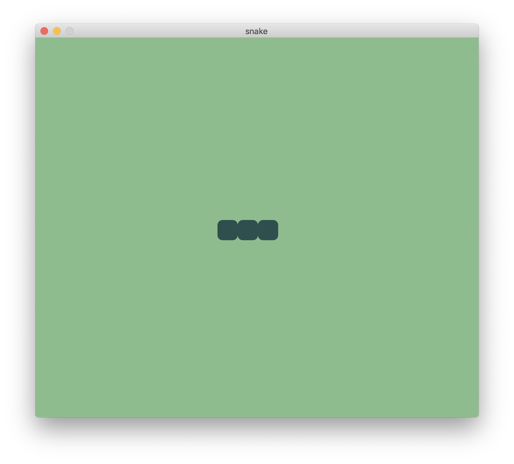

### 2. Draw a snake

In our retro game, all objects and their movements are organized in big square "cells". The pallet is a single cell and the snake a line of these cells moving one cell a step. We'll, therefore, describe our playing field as a grid of square cells addressable like a coordinate system:

- x-axis (the horizontal axis): composed of 21 columns (from 0 to 20)
- y-axis (the vertical axis): composed of 18 rows (from 0 to 17)

```
   │ 0│ 1│ 2│ 3│ 4│ 5│ 6│ 7│ 8│ 9│10│11│12│13│14│15│16│17│18│19│20│
───┼──┼──┼──┼──┼──┼──┼──┼──┼──┼──┼──┼──┼──┼──┼──┼──┼──┼──┼──┼──┼──┼───
  0│  │  │  │  │  │  │  │  │  │  │  │  │  │  │  │  │  │  │  │  │  │ 0
───┼──┼──┼──┼──┼──┼──┼──┼──┼──┼──┼──┼──┼──┼──┼──┼──┼──┼──┼──┼──┼──┼───
  1│  │  │  │  │  │  │  │  │  │  │  │  │  │  │  │  │  │  │  │  │  │ 1
───┼──┼──┼──┼──┼──┼──┼──┼──┼──┼──┼──┼──┼──┼──┼──┼──┼──┼──┼──┼──┼──┼───
  2│  │  │  │  │  │  │  │  │  │  │  │  │  │  │  │  │  │  │  │  │  │ 2
───┼──┼──┼──┼──┼──┼──┼──┼──┼──┼──┼──┼──┼──┼──┼──┼──┼──┼──┼──┼──┼──┼───
  3│  │  │  │  │  │  │  │  │  │  │  │  │  │  │  │  │  │  │  │  │  │ 3
───┼──┼──┼──┼──┼──┼──┼──┼──┼──┼──┼──┼──┼──┼──┼──┼──┼──┼──┼──┼──┼──┼───
  4│  │  │  │  │  │  │  │  │  │  │  │  │  │  │  │  │  │  │  │  │  │ 4
───┼──┼──┼──┼──┼──┼──┼──┼──┼──┼──┼──┼──┼──┼──┼──┼──┼──┼──┼──┼──┼──┼───
  5│  │  │  │  │  │  │  │  │  │  │  │  │  │  │  │  │  │  │  │  │  │ 5
───┼──┼──┼──┼──┼──┼──┼──┼──┼──┼──┼──┼──┼──┼──┼──┼──┼──┼──┼──┼──┼──┼───
  6│  │  │  │  │  │  │  │  │  │  │  │  │  │  │  │  │  │  │  │  │  │ 6
───┼──┼──┼──┼──┼──┼──┼──┼──┼──┼──┼──┼──┼──┼──┼──┼──┼──┼──┼──┼──┼──┼───
  7│  │  │  │  │  │  │  │  │  │  │  │  │  │  │  │  │  │  │  │  │  │ 7
───┼──┼──┼──┼──┼──┼──┼──┼──┼──┼──┼──┼──┼──┼──┼──┼──┼──┼──┼──┼──┼──┼───
  8│  │  │  │  │  │  │  │  │  │  │  │  │  │  │  │  │  │  │  │  │  │ 8
───┼──┼──┼──┼──┼──┼──┼──┼──┼──┼──┼──┼──┼──┼──┼──┼──┼──┼──┼──┼──┼──┼───
  9│  │  │  │  │  │  │  │  │  │  │  │  │  │  │  │  │  │  │  │  │  │ 9
───┼──┼──┼──┼──┼──┼──┼──┼──┼──┼──┼──┼──┼──┼──┼──┼──┼──┼──┼──┼──┼──┼───
 10│  │  │  │  │  │  │  │  │  │  │  │  │  │  │  │  │  │  │  │  │  │10
───┼──┼──┼──┼──┼──┼──┼──┼──┼──┼──┼──┼──┼──┼──┼──┼──┼──┼──┼──┼──┼──┼───
 11│  │  │  │  │  │  │  │  │  │  │  │  │  │  │  │  │  │  │  │  │  │11
───┼──┼──┼──┼──┼──┼──┼──┼──┼──┼──┼──┼──┼──┼──┼──┼──┼──┼──┼──┼──┼──┼───
 12│  │  │  │  │  │  │  │  │  │  │  │  │  │  │  │  │  │  │  │  │  │12
───┼──┼──┼──┼──┼──┼──┼──┼──┼──┼──┼──┼──┼──┼──┼──┼──┼──┼──┼──┼──┼──┼───
 13│  │  │  │  │  │  │  │  │  │  │  │  │  │  │  │  │  │  │  │  │  │13
───┼──┼──┼──┼──┼──┼──┼──┼──┼──┼──┼──┼──┼──┼──┼──┼──┼──┼──┼──┼──┼──┼───
 14│  │  │  │  │  │  │  │  │  │  │  │  │  │  │  │  │  │  │  │  │  │14
───┼──┼──┼──┼──┼──┼──┼──┼──┼──┼──┼──┼──┼──┼──┼──┼──┼──┼──┼──┼──┼──┼───
 15│  │  │  │  │  │  │  │  │  │  │  │  │  │  │  │  │  │  │  │  │  │15
───┼──┼──┼──┼──┼──┼──┼──┼──┼──┼──┼──┼──┼──┼──┼──┼──┼──┼──┼──┼──┼──┼───
 16│  │  │  │  │  │  │  │  │  │  │  │  │  │  │  │  │  │  │  │  │  │16
───┼──┼──┼──┼──┼──┼──┼──┼──┼──┼──┼──┼──┼──┼──┼──┼──┼──┼──┼──┼──┼──┼───
 17│  │  │  │  │  │  │  │  │  │  │  │  │  │  │  │  │  │  │  │  │  │17
───┼──┼──┼──┼──┼──┼──┼──┼──┼──┼──┼──┼──┼──┼──┼──┼──┼──┼──┼──┼──┼──┼───
   │ 0│ 1│ 2│ 3│ 4│ 5│ 6│ 7│ 8│ 9│10│11│12│13│14│15│16│17│18│19│20│
```

The main action in our game happens within one fixed view containing this grid. Scenic refers to this as one ["scene"](https://hexdocs.pm/scenic/overview_general.html#scene) of the application.

A scene is implemented as a [GenServer](https://elixir-lang.org/getting-started/mix-otp/genserver.html) process under the hood. It contains the state and all business logic to handle input by the user. Navigating between screens of the application means moving from scene to scene.

> Coach: Briefly talk about processes in Elixir, which allow keeping state, etc., and GenServers as the standard "interface" for processes.

So let's start building the main scene for our game!

Create a new file named `game.ex` in the `lib/scenes` directory of the project and open it. In there, we'll define a module called "Game".

```elixir
defmodule Snake.Scene.Game do
  use Scenic.Scene
end
```

We turn our module into a Scenic "scene" by using `Scenic.Scene`. This will automatically inject some functions into the module and require us to implement a certain "behavior". In our case, this means we'll have to implement an `init/2` callback. This function is called when the scene is started and meant to be used to set up the state of the scene. It takes two arguments, the first is passed in by the process which starts the scene and the second is an optional list of contextual options, such as information about the viewport:

```elixir
def init(arg, opts) do
  {:ok, :ok}
end
```

With that set up, let's restart our game:

    $ mix scenic.run

Nothing changed! We need to update the configuration of our project to make this scene the entry point for our application. So let's change the `default_scene` in the `config/config.exs` file to be our new `Game` module:

```elixir
default_scene: {Snake.Scene.Game, nil},
```

Run the application again and see there: a black screen!


That's a starting point!

Let's continue with the basis of our game: the cell grid. In order to know how many squares we can fit into the scene, we need some information about the size of the application window, the so-called _"viewport"_. We can retrieve that from the contextual information generated by Scenic and passed into our `init/2` function as the second `opts` parameter. We'll make use of the `info` function from Scenic's `ViewPort` module and print out what we get there:

```elixir
defmodule Snake.Scene.Game do
  use Scenic.Scene

  alias Scenic.ViewPort

  def init(arg, opts) do
    viewport = opts[:viewport]

    IO.inspect(ViewPort.info(viewport), label: "viewport info")

    {:ok, :ok}
  end
end
```

Running the game again, we see we have some information about the size of the viewport in pixels. We can use this information to compute the number of rows and columns in our grid. We'll define the default length of 32 pixels for the edge of one square and then compute how many we can fit onto the screen. As this information is necessary throughout the whole game, we store it in the `state` of the scene.

```elixir
@tile_size 32

def init(arg, opts) do
  viewport = opts[:viewport]

  {:ok, %ViewPort.Status{size: {vp_width, vp_height}}} = ViewPort.info(viewport)

  number_of_columns = div(vp_width, @tile_size)
  number_of_rows = div(vp_height, @tile_size)

  state = %{
    width: number_of_columns,
    height: number_of_rows
  }

  {:ok, :ok}
end
```

> Coach: Talk about assignments that use pattern matching

When running the game you may have noticed the compiler warning us:

    warning: variable "arg" is unused (if the variable is not meant to be used, prefix it with an underscore)

In our configuration, we are passing `nil` as the argument of the first parameter `arg` of the `init/2` function of our `Game` scene, which already indicates that we're not planning to provide any information meant for further usage here. So let's follow the compiler's suggestions and prefix the parameter with an underscore to indicate that we know about the parameter but don't need it:

```elixir
def init(_arg, opts) do
  viewport = opts[:viewport]

  {:ok, %ViewPort.Status{size: {vp_width, vp_height}}} = ViewPort.info(viewport)

  number_of_columns = div(vp_width, @tile_size)
  number_of_rows = div(vp_height, @tile_size)

  state = %{
    width: number_of_columns,
    height: number_of_rows
  }

  {:ok, :ok}
end
```

Next, we'll introduce the "graph" for our scene. The concept of a "graph" in Scenic is similar to the "DOM" in HTML: it's a hierarchical description of the objects drawn onto the scene. Graphs are immutable and can only be transformed via functions. We'll set up the initial graph at compile time.

> Coach: Talk about immutability in functional programming / Elixir.

```elixir
alias Scenic.ViewPort
alias Scenic.Graph

@graph Graph.build()
@tile_size 32
```

Running the app, you won't see any change yet. We have to push our graph to the viewport when we initialize the scene. We will also return the initial state we just set up:

```elixir
def init(_arg, opts) do
  viewport = opts[:viewport]

  {:ok, %ViewPort.Status{size: {vp_width, vp_height}}} = ViewPort.info(viewport)

  number_of_columns = div(vp_width, @tile_size)
  number_of_rows = div(vp_height, @tile_size)

  state = %{
    width: number_of_columns,
    height: number_of_rows
  }

  {:ok, state, push: @graph}
end
```

Let's run the game!

Nothing changed? That's because our graph does not contain any objects yet and we did not give it any attributes differing from Scenic's defaults.

Let's start by changing the default background of the scene from black to a more Nokia style color:

```elixir
@graph Graph.build(clear_color: :dark_sea_green)
```

Nice! We are already getting that 90s feeling!

The first object we want to draw on our scene is the snake. We'll define it as an ordered list of x and y coordinate pairs corresponding to the locations of the cells in the grid the snake is currently occupying. We'll refer to this as the "body" of the snake. That should be enough to be able to draw the snake onto the scene:

```elixir
snake = %{body: [{9, 9}]}
```

In order to actually draw it onto the scene, we need to add it to the graph of our scene. So let's update our initial graph and add our snake object to it.

```elixir
state = %{
  width: number_of_columns,
  height: number_of_rows
}

snake = %{body: [{9, 9}, {10, 9}, {11, 9}]}

graph = draw_snake(@graph, snake)

{:ok, state, push: graph}
```

To keep things organized, we'll implement our own `draw_snake/2` helper function which will turn our abstract snake object into actual drawable objects for Scenic. The function takes two arguments: the graph and our snake object.

For each square of the snake's body, we fill a cell on our grid.

```elixir
defp draw_snake(graph, %{body: snake}) do
  Enum.reduce(snake, graph, fn {x, y}, graph ->
    draw_tile(graph, x, y, fill: :dark_slate_gray)
  end)
end
```

Then we'll add a separate function to draw a single tile. We can use the `rounded_rectangle/3` function from Scenic's `Primitives` module for that. To keep the snake's body distinguishable, we'll draw the rectangle with rounded corners. Black is the default fill color, but whatever is passed in via the `opts` argument will override that.

```elixir
import Scenic.Primitives, only: [rounded_rectangle: 3]

@tile_radius 8

defp draw_tile(graph, x, y, opts) do
  tile_opts = Keyword.merge([fill: :black, translate: {x * @tile_size, y * @tile_size}], opts)
  rounded_rectangle(graph, {@tile_size, @tile_size, @tile_radius}, tile_opts)
end
```

Now we have the first objects in our graph. Let's see how this looks like!

Our snake does not look too snaky yet if it's that short. Let's change that and make it occupy three tiles:

```elixir
snake = %{body: [{9, 9}, {10, 9}, {11, 9}]}
```



[Let's make the snake move](./03-let-the-snake-move.md)
