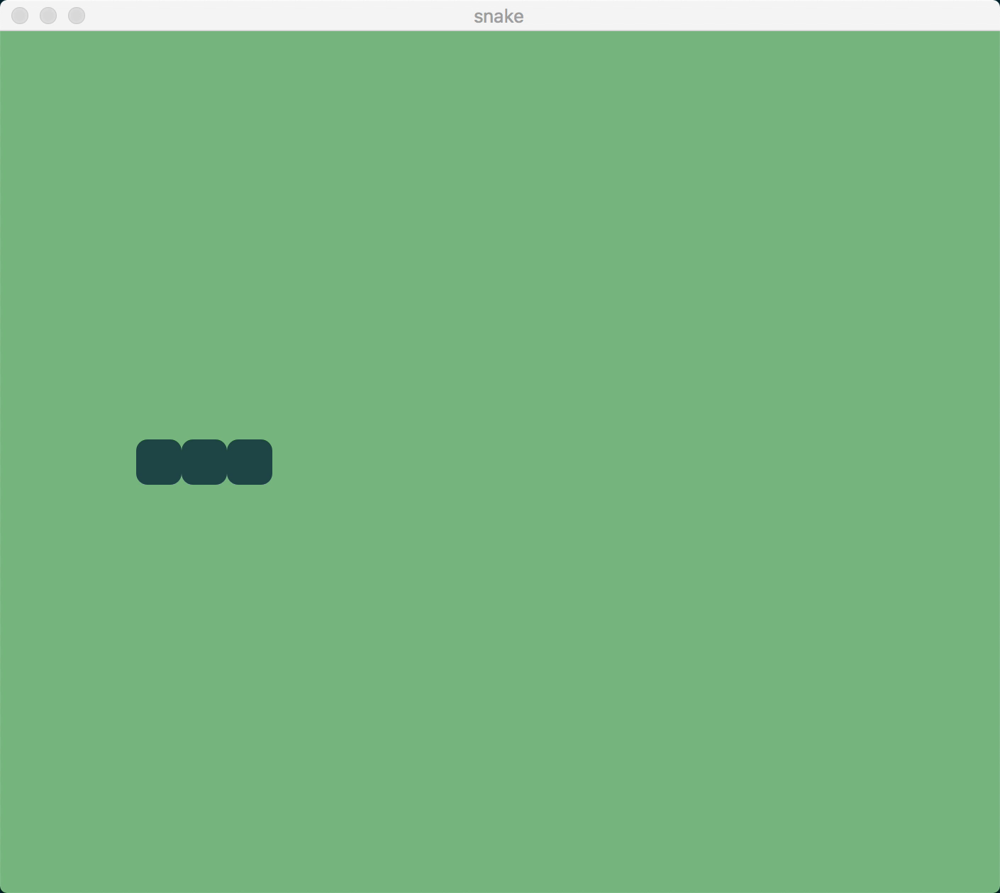

### 3. Let the Snake Move

The fast and constantly moving snake is what makes the game challenging to play. Players can only "steer" the direction the snake is turning to. The always hungry animal is automatically moving forward all the time.

To add this aspect to our currently static game scene, we need to periodically update the graph and re-render the scene, moving the position of our snake one tile forward each time. Being a `GenServer` process under the hood, our `Game` scene can send and receive messages from any Elixir process, including itself. When initializing the scene, we'll also start a periodically ticking timer that will send a message to the scene process every time the snake position should change. We can make use of Erlang's built in `:timer` module for that and send a `:frame` message every `192` milliseconds to our `GenServer`.

> Coach: Explain interoperability between Elixir and Erlang.

```elixir
@graph Graph.build(clear_color: :dark_sea_green)
@tile_size 32
@tile_radius 8
@frame_ms 192

def init(_arg, opts) do
  viewport = opts[:viewport]

  {:ok, %ViewPort.Status{size: {vp_width, vp_height}}} = ViewPort.info(viewport)

  number_of_columns = div(vp_width, @tile_size)
  number_of_rows = div(vp_height, @tile_size)

  state = %{
    width: number_of_columns,
    height: number_of_rows
  }

  snake = %{body: [{11, 9}, {10, 9}, {9, 9}]}
  graph = draw_snake(@graph, snake)

  # start timer
  {:ok, _timer} = :timer.send_interval(@frame_ms, :frame)

  {:ok, state, push: graph}
end
```

Then we need to implement the `handle_info/2` callback function where our scene process can receive incoming messages in the format `{type, state}`. We'll match on the `type` tuple to make sure we're handling the right message. We'll for now just output some logging information to see what's happening:

```elixir

def init(_arg, opts) do
  # ...
  {:ok, state, push: graph}
end

def handle_info(:frame, state) do
  IO.puts("tick")

  {:noreply, state}
end
```

In order to move the snake one tile forward, we need to keep track of its position. We can achieve this by including the `snake` in the scene's state:

```elixir
state = %{
  width: number_of_columns,
  height: number_of_rows,
  snake: %{body: [{11, 9}, {10, 9}, {9, 9}]}
}
```

We'll also need to adapt our `draw_snake/2` function to pattern match on the whole state as argument instead of just the snake object.

```elixir
defp draw_snake(graph, %{snake: %{body: body}}) do
  Enum.reduce(body, graph, fn {x, y}, graph ->
    draw_tile(graph, x, y, fill: :dark_slate_gray)
  end)
end
```

There's one last piece of information missing before we can start working on making the snake move. We need to add the snake direction to the state, so we know how to update its body coordinates. Later on, we'll be able to change its direction, but for now it will only move to the right.

So how can we represent the snake direction? Since this is a 2 dimensional game, it seems natural to represent it as a pair of values, one for each axis (x, y). Or, translating it to the Elixir world, as a tuple `{x, y}`.

```
          │-1
          │
          │
          │
-1 ───────┼────────> 1
          │0
          │
          │
          │1
```

Based on the Cartesian system above, we can define the direction of the snake as:

- left: `{-1, 0}`
- right: `{1, 0}`
- top: `{0, -1}`
- down: `{0, 1}`

Let's add this information to the snake object:

```elixir
state = %{
  width: number_of_columns,
  height: number_of_rows,
  snake: %{body: [{11, 9}, {10, 9}, {9, 9}], direction: {1, 0}}
}
```

Now we're ready to implement the movement logic. Let's recall what happens during the game when you turn the snake. At first, only the head turns, right? It's the head that controls the movement. At each step, the snake moves as if we were placing a new head on the tile that we want to move to and removing the last tile in the snake tail, so that its size is preserved. Or, in mathematical terms, that would be equivalent to adding a new tuple to the beginning of the list and removing another one from the end.

```elixir
defp move_snake(%{snake: snake} = state) do
  %{body: body, direction: direction} = snake

  # new head's position
  [head | _] = body
  new_head = move(state, head, direction)

  # place a new head on the tile that we want to move to
  # and remove the last tile from the snake tail
  new_body = List.delete_at([new_head | body], -1)

  state
  |> put_in([:snake, :body], new_body)
end

defp move(%{width: w, height: h}, {pos_x, pos_y}, {vec_x, vec_y}) do
  # We use the remainder function `rem` to make the snake appear from the opposite side
  # of the screen when it reaches the limits of the graph.
  x = rem(pos_x + vec_x + w, w)
  y = rem(pos_y + vec_y + h, h)
  {x, y}
end
```

The next step will be to update our `handle_info/2` callback with the function we just created. We'll also do some refactoring to make things cleaner, by delegating the responsibility of drawing the objects in the graph and pushing it to the viewport to our `handle_info/2` callback, instead of `init/2`. After these changes, our `handle_info/2` callback will look like this:

```elixir
def handle_info(:frame, state) do
  new_state = move_snake(state)
  graph = draw_snake(@graph, new_state)

  {:noreply, new_state, push: graph}
end
```

So at every tick of the timer, the state of the scene will be updated with the new coordinates of the snake body and the snake object will be added on top of the initial `@graph`. The `init/2` callback will be responsible only for setting up the initial state, triggering a timer to send a message to our scene at each `@frame_ms` interval and pushing the initial `@graph`. Here's how it should look like now:

```elixir
def init(_arg, opts) do
  viewport = opts[:viewport]

  {:ok, %ViewPort.Status{size: {vp_width, vp_height}}} = ViewPort.info(viewport)

  number_of_columns = div(vp_width, @tile_size)
  number_of_rows = div(vp_height, @tile_size)

  state = %{
    width: number_of_columns,
    height: number_of_rows,
    snake: %{body: [{9, 9}, {10, 9}, {11, 9}], direction: {1, 0}}
  }

  # start timer
  {:ok, _timer} = :timer.send_interval(@frame_ms, :frame)

  {:ok, state, push: @graph}
end
```

As a last step before we move on to the next chapter, let's update the viewport size in the `config/config.exs` file, so that the snake better fits to it.

```elixir
config :snake, :viewport, %{
  # ...
  size: {704, 608},
  # ...
}
```



[Let's control the snake](./04-control-snake-movements.md)
