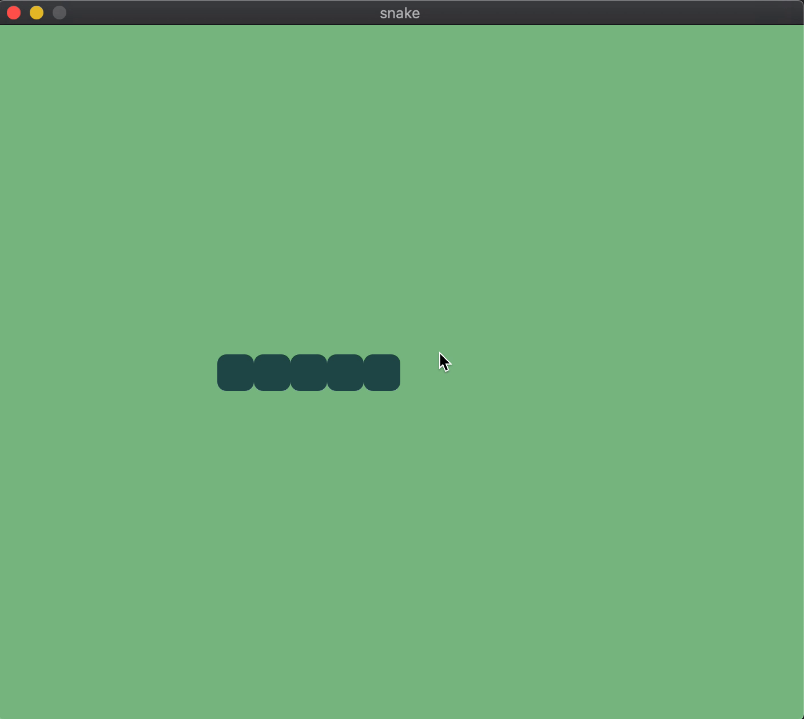

### 4. Control snake movements

Awesome! Our snake moves fast tile by tile, but we cannot control it yet. Kinda boring, isn't it?

In order to control the snake, we need to handle keyboard inputs when pressing any arrow key and change the snake direction accordingly.

☝️ Remember, the direction is saved in the scene's state as a tuple `{x, y}`.

We need to map all the arrow keys inputs into our direction system:

- when pressing the left arrow key ⬅️, the snake direction needs to be set to `{-1, 0}`.
- when pressing the right arrow key ➡️, the snake direction needs to be set to `{1, 0}`.
- when pressing the up arrow key ⬆️, the snake direction needs to be set to `{0, -1}`.
- when pressing the down arrow key ⬇️, the snake direction needs to be set to `{0, 1}`.

And eventually, we need to ignore any other keypress input (e.g. space bar, return, etc.).

Scenic conveniently provides us the [`handle_input/3`](https://hexdocs.pm/scenic/Scenic.Scene.html#c:handle_input/3) callback to implement it.

> Coach: Explain what a callback is and how it is used for defining behaviours.

`handle_input/3` is invoked when the scene receives input from the underlying hardware. It may consume the received input message or propagate it further up to the View Port's supervision structure.

In our case, we will use the handler to update the direction in the scene's state without propagating the received input further up.

> Coach: Explain event bubbling and ViewPort's supervision structure.

> Coach: Explain what is an input and how it [differs from events](https://hexdocs.pm/scenic/Scenic.Scene.html#module-input-vs-events).

`handle_input/3` requires three arguments:

- the input message
- the input's context (👈 ignore it, we won't need it)
- the scene's current state

And, in our case, it will always return a tuple like `{:noreply, new_state}` where:

- `:noreply` indicates that the input won't be propagated up to the parent scene.
- `new_state` is the new state of the scene with the updated direction based on the received input.

The input is described using a `tuple`. For example, the left arrow key ⬅️ input is described as:

```
{:key, {"left", :press, 0}}
```

The first element of the tuple `key` describes the kind of input received.

The second element of the tuple is another tuple `{"left", :press, 0}` where:

- `"left"` describes which key has been interacted with
- `:press` describes the kind of interaction (`:press`, `:release` or `:repeat`)
- `0` is the modifier value, which becomes non-zero when we press the key while holding another key like <kbd>Shift</kbd> or <kbd>CTRL</kbd>.

Let's add the handlers to our scene! We'll use pattern matching to match the right handler function based on the received input:

```elixir
# Keyboard controls
def handle_input({:key, {"left", :press, _}}, _context, state) do
  new_state = put_in(state, [:snake, :direction], {-1, 0})
  {:noreply, new_state}
end

def handle_input({:key, {"right", :press, _}}, _context, state) do
  new_state = put_in(state, [:snake, :direction], {1, 0})
  {:noreply, new_state}
end

def handle_input({:key, {"up", :press, _}}, _context, state) do
  new_state = put_in(state, [:snake, :direction], {0, -1})
  {:noreply, new_state}
end

def handle_input({:key, {"down", :press, _}}, _context, state) do
  new_state = put_in(state, [:snake, :direction], {0, 1})
  {:noreply, new_state}
end

# Ignore all the other inputs
def handle_input(_input, _context, state), do: {:noreply, state}
```

☝️ The [`put_in`](https://hexdocs.pm/elixir/Kernel.html#put_in/2) helper is used to update the `direction` in the scene's state.

And here we are, now we can control the snake 🎉



We can slightly simplify the code and extract a common utility to compute the new state.

```elixir
# Keyboard controls
def handle_input({:key, {"left", :press, _}}, _context, state) do
  {:noreply, update_snake_direction(state, {-1, 0})}
end

def handle_input({:key, {"right", :press, _}}, _context, state) do
  {:noreply, update_snake_direction(state, {1, 0})}
end

def handle_input({:key, {"up", :press, _}}, _context, state) do
  {:noreply, update_snake_direction(state, {0, -1})}
end

def handle_input({:key, {"down", :press, _}}, _context, state) do
  {:noreply, update_snake_direction(state, {0, 1})}
end

# Ignore all the other inputs
def handle_input(_input, _context, state), do: {:noreply, state}

# Change the snake's current direction.
defp update_snake_direction(state, direction) do
  put_in(state, [:snake, :direction], direction)
end
```

☝️ Please note that the newly extracted function `update_snake_direction` is private.

> Coach: Explain differences between public and private functions.


### 5. Add food for the snake

### 6. Allow snake to eat

### 7. Allow snake to die

### 8. Add static score

### 9. Add live scoring

### 10. Potential later steps

- move things into components (e.g. the score, the snake)
- add multiplayer
