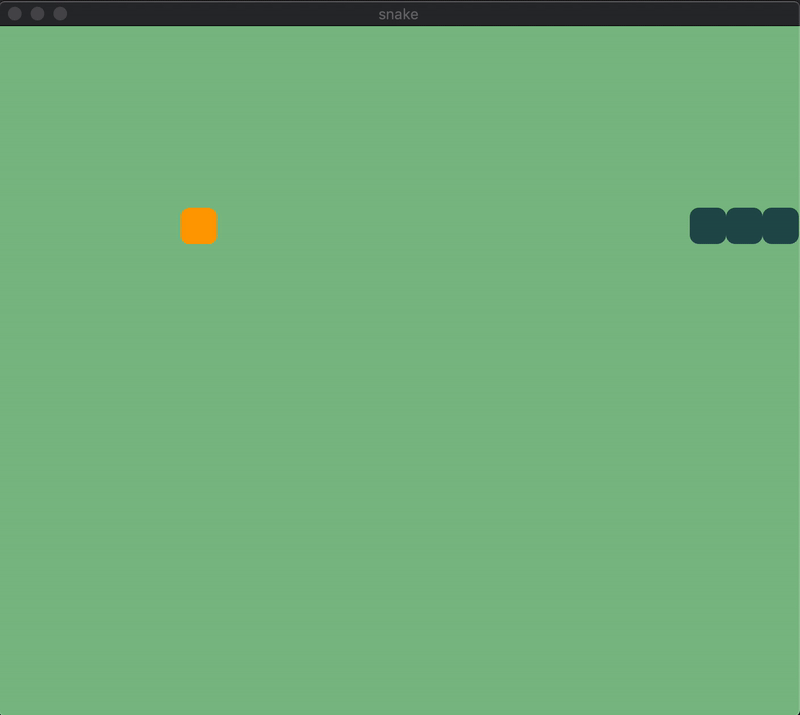

### 5. Add food for snake

Our snake can move free, but it's still missing an another important piece of the game: the food pellet.

The food pellet is basically an object composed by one single tile and therefore can be represented by a pair of coordinates `{x,y}`.

In order to introduce it, we need to:

- Add the food to the initial state of the game, its coordinates must not overlap with the snake's body.
- Draw the food pellet each game tick as we are doing for the snake body, but its value won't change (at least for the moment).

For addressing the first point, we can simply update the initial state in the `init/2` function, and that's all.

```elixir
def init(_arg, opts) do
  viewport = opts[:viewport]

  {:ok, %ViewPort.Status{size: {vp_width, vp_height}}} = ViewPort.info(viewport)

  number_of_columns = div(vp_width, @tile_size)
  number_of_rows = div(vp_height, @tile_size)

  state = %{
    width: number_of_columns,
    height: number_of_rows,
    snake: %{body: [{9, 9}, {10, 9}, {11, 9}], direction: {1, 0}}
    pellet: %{5, 5}
  }

  # start timer
  {:ok, _timer} = :timer.send_interval(@frame_ms, :frame)

  {:ok, state, push: @graph}
end
```

Then, we need to update our application to draw the food pellet each game tick. If you look at the `init/2` function above, there is a timer that periodically sends a message, this is intercepted by our `handle_info/2` callback, which is in charge of moving the snake and then drawing it.

👆We need to update the `handle_info/2` to draw the food pellet as well.

```elixir
def handle_info(:frame, state) do
  new_state = move_snake(state)
  graph = @graph
  |> draw_snake(new_state)
  |> draw_pellet(new_state)

  {:noreply, new_state, push: graph}
end

# Pellet is simply a coordinate pair
defp draw_pellet(graph, %{pellet: {x, y}}) do
  draw_tile(graph, x, y, fill: :orange)
end

# Snake's body is a list of coordinate pairs
defp draw_snake(graph, %{snake: %{body: body}}) do
  Enum.reduce(body, graph, fn {x, y}, graph ->
    draw_tile(graph, x, y, fill: :dark_slate_gray)
  end)
end
```

Yay! Everything now is in place, let's run the game and verify that works.

    $ mix scenic.run

Great! But there is room for minor improvements. The `draw_snake` and `draw_pellet` functions have some traits in common, maybe we can generalize them.

```elixir
def handle_info(:frame, state) do
  new_state = move_snake(state)
  graph = @graph
  |> draw_object(:snake, new_state)
  |> draw_object(:pellet, new_state)

  {:noreply, new_state, push: graph}
end

# Pellet is simply a coordinate pair
defp draw_object(graph, :pellet, %{pellet: {x, y}}) do
  draw_tile(graph, x, y, fill: :orange)
end

# Snake's body is a list of coordinate pairs
defp draw_object(graph, :snake, %{snake: %{body: body}}) do
  Enum.reduce(body, graph, fn {x, y}, graph ->
    draw_tile(graph, x, y, fill: :dark_slate_gray)
  end)
end
```

Ok, but we can do better. What if we update the state to keep all the objects that need to be drawn at each game tick under the key `:object`, then we can map over them and draw them with the help of the pattern matching. Easier to do than to explain.

```elixir
def init(_arg, opts) do
  viewport = opts[:viewport]

  {:ok, %ViewPort.Status{size: {vp_width, vp_height}}} = ViewPort.info(viewport)

  number_of_columns = div(vp_width, @tile_size)
  number_of_rows = div(vp_height, @tile_size)

  state = %{
    width: number_of_columns,
    height: number_of_rows,
    objects: %{
      snake: %{body: [{9, 9}, {10, 9}, {11, 9}], direction: {1, 0}}
      pellet: %{5, 5}
    },
  }

  # start timer
  {:ok, _timer} = :timer.send_interval(@frame_ms, :frame)

  {:ok, state, push: @graph}
end

# ...

def handle_info(:frame, state) do
  new_state = move_snake(state)
  graph = @graph |> draw_objects(new_state.objects)

  {:noreply, new_state, push: graph}
end

defp draw_objects(graph, objects) do
  Enum.reduce(objects, graph, fn {type, object}, graph ->
    draw_object(graph, type, object)
  end)
end

# Pellet is simply a coordinate pair
defp draw_object(graph, :pellet, {x, y}) do
  draw_tile(graph, x, y, fill: :orange)
end

# Snake's body is a list of coordinate pairs
defp draw_object(graph, :snake, %{body: body}) do
  Enum.reduce(body, graph, fn {x, y}, graph ->
    draw_tile(graph, x, y, fill: :dark_slate_gray)
  end)
end
```

And here we are, probably let's indirect than before, but we are exploring the elixir power here! 💪

Ah, and don't forget to change all the functions that read or update the snake body since we nest it under the `:object` key in the state.


